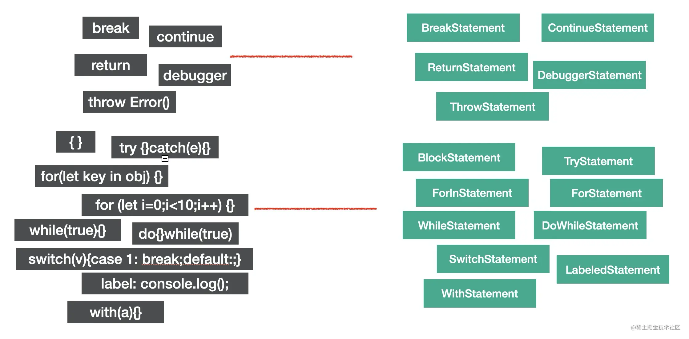
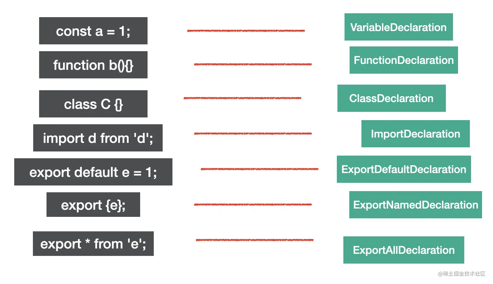
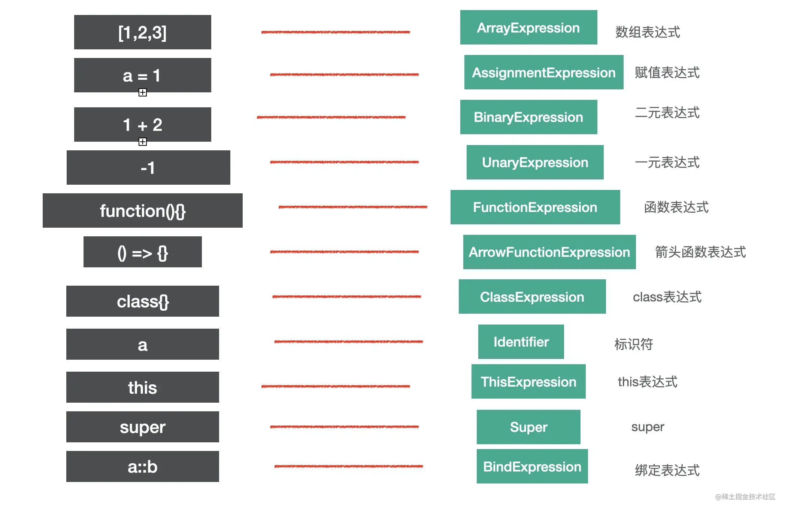

# Babel 的 AST

## 常见的 AST 节点

  ### Literal(字面量)

```js
let a = 'beige'
let b = `${a} is ck`
let c = 20
let d = /[a-z]/g
let f = true
let g = BigInt(1n)
let h = null
```  
a: 字符串字面量(StringLiteral)
b: 模板字符串字面量(TemplateLiteral)
c: 数字字面量(NumberLiteral)
d: 正则字面量(RegExxpLiterfal)
f: 布尔字面量(BooleanLiteral)
g: 大数字面量(BigIntLiterfal)
h: 空值字面量(NullLiterfal)


### Identifier(标识符)

> 变量名、属性名、参数名等各种声明和引用的名字，都是Identifer, JS 中的标识符只能包含字母或数字或下划线（“_”）或美元符号（“$”），且不能以数字开头。这是 Identifier 的词法特点。

```js
const name = 'beige';
function say(name) {
  console.log(name);
}
const obj = {
  name: 'beige'
}
```
以上有7个Idenifer

### Statement(语句)

statement 是语句，它是可以独立执行的单位，比如 break、continue、debugger、return 或者 if 语句、while 语句、for 语句，还有声明语句，表达式语句等。我们写的每一条可以独立执行的代码都是语句。

语句末尾一般会加一个分号分隔，或者用换行分隔。

下面这些我们经常写的代码，每一行都是一个 Statement

```js
break;
continue;
return;
debugger;
throw Error();
{}
try {} catch(e) {} finally{}
for (let key in obj) {}
for (let i = 0;i < 10;i ++) {}
while (true) {}
do {} while (true)
switch (v){case 1: break;default:;}
label: console.log();
with (a){}
```


### Declaration(声明语句)

声明语句是一种特殊的语句，它执行的逻辑是在作用域内声明一个变量、函数、class、import、export 等。

```js
const a = 1;
function b(){}
class C {}

import d from 'e';

export default e = 1;
export {e};
export * from 'e';
```



### Expression

expression 是表达式，特点是执行完以后有返回值，这是和语句 (statement) 的区别。

下面是一些常见的表达式

```js
[1,2,3]
a = 1
1 + 2;
-1;
function(){};
() => {};
class{};         
a;
this;
super;
a::b;
```
